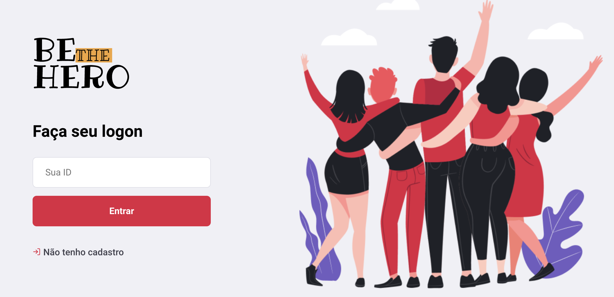
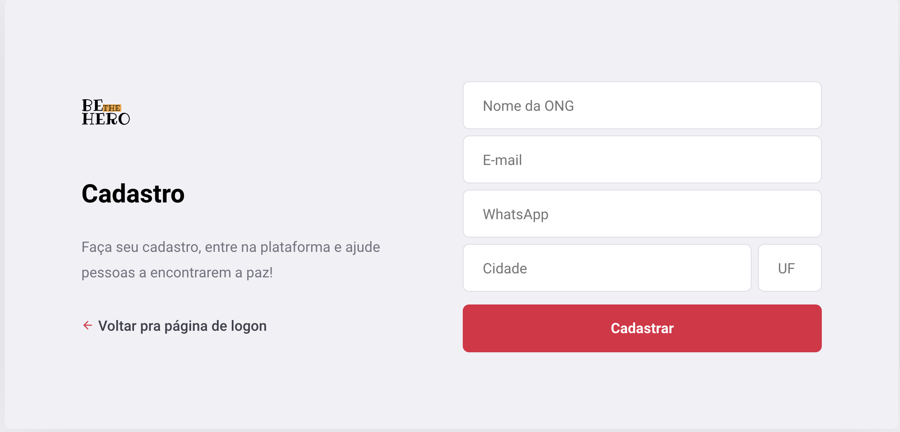
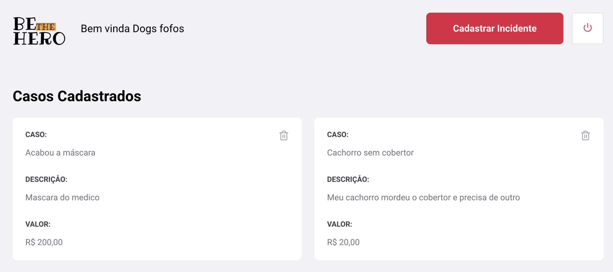
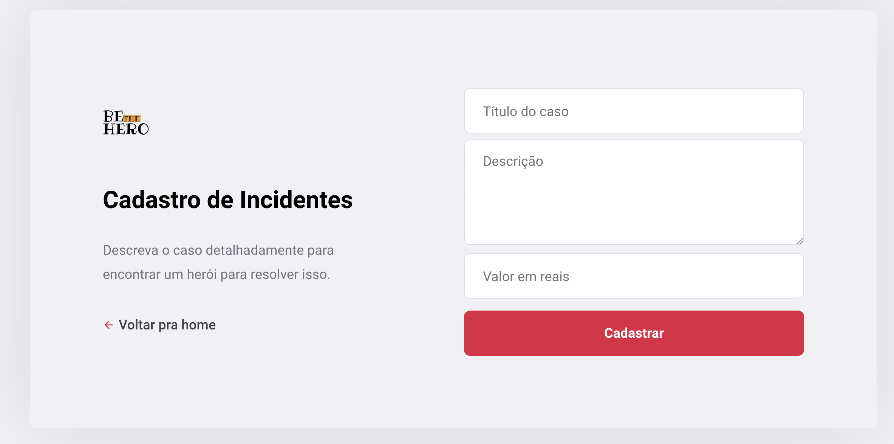

<h1 align="center">
  
</h1>

<h3 align="center">
  Aplicação desenvolvida na semana OminiStack 11
</h3>

**WebApp Screenshots**

   

**Rotas**

Essas sãos as rotas disponíveis na aplicação.

| Recurso     | Método                    | Utilização                                    |
| ----------- | ------------------------- | --------------------------------------------- |
| `/login`    | [`POST`]                  | Logar na aplicação                            |
| `/ongs`     | [`GET`, `POST`]           | Listar / Cadastrar ONGs                       |
| `/ongs`     | [`GET`, `POST`]           | Listar / Cadastrar ONGs                       |
| `/incident` | [`GET`, `POST`, `DELETE`] | Listar / Cadastrar / Deletar Casos de uma ONG |
| `/profile`  | [`GET`]                   | Listar Casos específicos de uma ONG (pelo ID) |

**Tecnologias utilizadas**

- [Node](https://github.com/albino29/rocketseat-bootcamp/tree/6107a3f0dbd36b410658cdb2946725a0285d481c/node.org) \(12.13.1\)
- [Npm](https://github.com/albino29/rocketseat-bootcamp/tree/6107a3f0dbd36b410658cdb2946725a0285d481c/node.org) \(6.12.1\)
- [Yarn](https://github.com/albino29/rocketseat-bootcamp/tree/6107a3f0dbd36b410658cdb2946725a0285d481c/node.org) \(1.19.1\)
